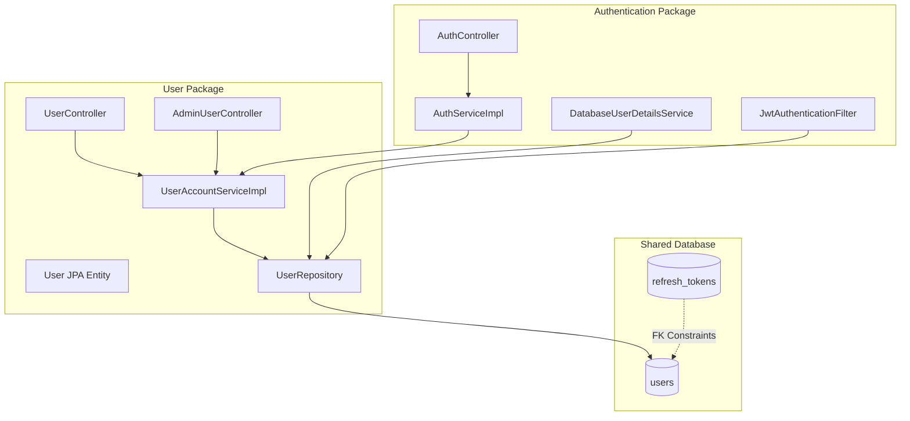

# AI Laboratory Authentication and User Services — Current-State Backend Audit

**Auditor:** Senior Java/Spring Backend Architect, Application-Security Reviewer, Database Reviewer, and Production-Readiness Auditor  
**Date of Audit:** August 4, 2026  
**Repository Branch:** `Aminjon`  
**Maturity Grade:** **C** (Partially functional with major architectural and security gaps)

---

## 1. Executive Summary

### Overview
This audit provides a factual analysis of the current-state backend codebase for the AI Laboratory. The backend currently contains two core modules: the **Authentication Service** and the **User Service**. Modules such as the Chemistry Engine, Laboratory Service, and API Gateway are intentionally absent.

### Key Metrics and Status
*   **Compilation Status:** **PASS** (Requires environmental configuration override). The default system JVM is Java 17, but the project targets Java 21, causing an initial build failure. Bypassing this requires pointing the build system to a Java 21 JDK (e.g., using the bundled runtime inside IntelliJ IDEA).
*   **Test Status:** **PASS** (35 tests run, 35 passed, 0 failed, 0 skipped).
*   **Authentication Service Status:** **PARTIALLY_IMPLEMENTED** with high-severity architectural leaks. High risks include brute-force vulnerability, global session invalidation on single logout, and database queries on every request.
*   **User Service Status:** **PARTIALLY_IMPLEMENTED**. Profile updates and settings are functional, but the avatar storage is a placeholder (accepts any arbitrary string without checking file validity or integrating object storage), and level/XP/achievements are empty database fields lacking gameplay mechanics logic.
*   **Production-Readiness Verdict:** **NOT PRODUCTION-READY**. Multiple critical and high security findings must be resolved.
*   **Readiness for Chemistry Engine Development:** **BLOCKED**. The service boundaries between Authentication and User accounts are tightly coupled at the database, model, and service layers. Proceeding directly to Chemistry Engine development before stabilizing these layers will propagate database coupling into the Laboratory Service and Chemistry Engine.

---

## 2. Repository Baseline

### Technology Stack & Architecture
*   **Java Version:** 21 (configured in `pom.xml`, but system default JVM is 17.0.15, acting as a build blocker).
*   **Spring Boot Version:** 3.4.5 (using `spring-boot-starter-parent` parent POM).
*   **Build System:** Maven (using `pom.xml`, Maven wrapper `mvnw` is absent from the repository).
*   **Database:** PostgreSQL (driver version managed by Spring Boot starter, Flyway used for migrations).
*   **Infrastructure Configuration:** No configuration or dependencies exist for Redis, RabbitMQ, MinIO, or Docker.
*   **API Documentation:** Springdoc OpenAPI UI (`springdoc-openapi-starter-webmvc-ui:2.8.6`) is configured at `/swagger-ui.html` and OpenAPI JSON docs are at `/v3/api-docs`.
*   **Architectural Style:** Package-based Modular Monolith. The package boundaries (`com.ailab.auth` and `com.ailab.user`) partition logic in Java, but share a single database, a single `users` table, and a shared JPA `User` entity.

### Repository Tree
```text
c:\Users\User\Documents\ailab
├── Backend
│   ├── pom.xml
│   ├── README.md
│   └── src
│       ├── main
│       │   ├── java
│       │   │   └── com
│       │   │       └── ailab
│       │   │           ├── AiLaboratoryApplication.java
│       │   │           ├── auth
│       │   │           │   ├── api
│       │   │           │   │   └── AuthDtos.java
│       │   │           │   ├── config
│       │   │           │   │   └── SecurityConfig.java
│       │   │           │   ├── controller
│       │   │           │   │   └── AuthController.java
│       │   │           │   ├── security
│       │   │           │   │   ├── AccessTokenIssuer.java
│       │   │           │   │   ├── DatabaseUserDetailsService.java
│       │   │           │   │   ├── JwtAuthenticationFilter.java
│       │   │           │   │   └── JwtService.java
│       │   │           │   ├── service
│       │   │           │   │   ├── AuthService.java
│       │   │           │   │   └── AuthServiceImpl.java
│       │   │           │   └── token
│       │   │           │       ├── RefreshToken.java
│       │   │           │       ├── RefreshTokenOperations.java
│       │   │           │       ├── RefreshTokenRepository.java
│       │   │           │       ├── RefreshTokenReuseException.java
│       │   │           │       └── RefreshTokenService.java
│       │   │           ├── common
│       │   │           │   ├── api
│       │   │           │   │   ├── ApiError.java
│       │   │           │   │   └── GlobalExceptionHandler.java
│       │   │           │   └── config
│       │   │           │       └── OpenApiConfig.java
│       │   │           └── user
│       │   │               ├── api
│       │   │               │   └── UserDtos.java
│       │   │               ├── controller
│       │   │               │   ├── AdminUserController.java
│       │   │               │   └── UserController.java
│       │   │               ├── domain
│       │   │               │   ├── Role.java
│       │   │               │   ├── User.java
│       │   │               │   └── UserDeletedEvent.java
│       │   │               ├── infrastructure
│       │   │               │   └── UserDataSeeder.java
│       │   │               ├── repository
│       │   │               │   └── UserRepository.java
│       │   │               └── service
│       │   │                   ├── UserAccountService.java
│       │   │                   └── UserAccountServiceImpl.java
│       │   └── resources
│       │       ├── application.properties
│       │       ├── application-local.properties
│       │       ├── application-prod.properties
│       │       └── db
│       │           └── migration
│       │               ├── V1__create_users.sql
│       │               ├── V2__create_refresh_tokens.sql
│       │               └── V3__add_user_preferences_statistics.sql
│       └── test
│           └── java
│               └── com
│                   └── ailab
│                       ├── auth
│                       │   ├── controller
│                       │   │   └── AuthControllerTest.java
│                       │   ├── security
│                       │   │   ├── DatabaseUserDetailsServiceTest.java
│                       │   │   ├── JwtAuthenticationFilterTest.java
│                       │   │   └── JwtServiceTest.java
│                       │   ├── service
│                       │   │   └── AuthServiceImplTest.java
│                       │   └── token
│                       │       └── RefreshTokenServiceTest.java
│                       ├── common
│                       │   └── api
│                       │       └── GlobalExceptionHandlerTest.java
│                       └── user
│                           ├── controller
│                           │   ├── AdminUserControllerTest.java
│                           │   └── UserControllerTest.java
│                           ├── infrastructure
│                           │   └── UserDataSeederTest.java
│                           └── service
│                               └── UserAccountServiceImplTest.java
└── Frontend
    └── .gitkeep
```

---

## 3. Build and Test Evidence

The following verification commands were executed.

### Command 1: Compilation Check (Failed initially due to JDK mismatch)
```powershell
# Executed in: c:\Users\User\Documents\ailab\Backend
& "C:\Users\User\Downloads\toir-backend-main\toir-backend-main\.mvn\wrapper\apache-maven-3.9.11\bin\mvn.cmd" clean test-compile
```
*   **Result:** `BUILD FAILURE`
*   **Error Details:** `Fatal error compiling: error: release version 21 not supported`
*   **Blocker:** The local command-line environment runs JVM version `17.0.15`, which does not support compiling for Java 21.

### Command 2: Successful Compilation (Bypassed using JDK 21)
```powershell
# Set JAVA_HOME to IntelliJ's bundled JDK 21 and compiled
$env:JAVA_HOME = "C:\Program Files\JetBrains\IntelliJ IDEA 2025.2.1\jbr"
& "C:\Users\User\Downloads\toir-backend-main\toir-backend-main\.mvn\wrapper\apache-maven-3.9.11\bin\mvn.cmd" clean test-compile
```
*   **Result:** `BUILD SUCCESS` (Compiling 28 source files to classes and 11 test files to test-classes in 3.485 seconds).

### Command 3: Test Suite Execution
```powershell
$env:JAVA_HOME = "C:\Program Files\JetBrains\IntelliJ IDEA 2025.2.1\jbr"
& "C:\Users\User\Downloads\toir-backend-main\toir-backend-main\.mvn\wrapper\apache-maven-3.9.11\bin\mvn.cmd" clean test
```
*   **Result:** `BUILD SUCCESS`
*   **Total Tests Run:** 35
*   **Passed:** 35
*   **Failed:** 0
*   **Skipped:** 0
*   **Coverage Reports:** No coverage reporting tool (like JaCoCo) is configured in the `pom.xml`.

---

## 4. Authentication Service Audit

### 4.1 Registration
*   **Status:** `PARTIALLY_IMPLEMENTED`
*   **Relevant Files:** 
    *   [`AuthController.java`](file:///c:/Users/User/Documents/ailab/Backend/src/main/java/com/ailab/auth/controller/AuthController.java#L30-L34)
    *   [`AuthServiceImpl.java`](file:///c:/Users/User/Documents/ailab/Backend/src/main/java/com/ailab/auth/service/AuthServiceImpl.java#L29-L32)
    *   [`UserAccountServiceImpl.java`](file:///c:/Users/User/Documents/ailab/Backend/src/main/java/com/ailab/user/service/UserAccountServiceImpl.java#L29-L35)
*   **Observed Implementation:** Registration delegates to `UserAccountService.register`, which performs SQL checks for existing emails/usernames, hashes the password using `PasswordEncoder` inside the User Service layer, and saves a `User` entity to the shared `users` table.
*   **Missing Behaviour:** No email confirmation verification workflow. No user profile initialization isolated from auth credentials.
*   **Risks:** Raw credentials flow directly through the User Service, violating separation of concerns. Weak password size restriction checks in DTOs (`@Size(min = 8, max = 100)`) but no password complexity policy.
*   **Test Evidence:** Verified in `AuthServiceImplTest.java` and `UserAccountServiceImplTest.java` via Mockito unit tests.
*   **Recommended Action:** Move the password hashing logic to the Authentication Service layer. Redesign registration so that the Authentication Service handles credential storage and sends a message/event or executes a synchronous call to the User Service to initialize a separate user profile record.

### 4.2 Login
*   **Status:** `PARTIALLY_IMPLEMENTED`
*   **Relevant Files:** 
    *   [`AuthController.java`](file:///c:/Users/User/Documents/ailab/Backend/src/main/java/com/ailab/auth/controller/AuthController.java#L36-L39)
    *   [`AuthServiceImpl.java`](file:///c:/Users/User/Documents/ailab/Backend/src/main/java/com/ailab/auth/service/AuthServiceImpl.java#L35-L40)
*   **Observed Implementation:** Passes request email and password to `AuthenticationManager.authenticate` and loads the user from `DatabaseUserDetailsService`.
*   **Missing Behaviour:** 
    *   No tracking of failed login attempts.
    *   No locked or disabled account statuses (only throws `BadCredentialsException`).
    *   No brute-force protection (e.g., locking out IP or account after $N$ failed attempts) or rate-limiting.
    *   No login audit trail logging.
*   **Risks:** Account credentials can be brute-forced or stuffed easily.
*   **Test Evidence:** Mockey-tested in `AuthServiceImplTest.java`.
*   **Recommended Action:** Introduce login rate-limiting (using bucket4j or Spring security limits) and implement an account lockout policy (e.g., track failed attempts in DB or cache).

### 4.3 Password Storage
*   **Status:** `IMPLEMENTED_IN_WRONG_LAYER`
*   **Relevant Files:** 
    *   [`SecurityConfig.java`](file:///c:/Users/User/Documents/ailab/Backend/src/main/java/com/ailab/auth/config/SecurityConfig.java#L30-L32)
    *   [`UserAccountServiceImpl.java`](file:///c:/Users/User/Documents/ailab/Backend/src/main/java/com/ailab/user/service/UserAccountServiceImpl.java#L34)
*   **Observed Implementation:** Configures `BCryptPasswordEncoder` bean in the security config but invokes it to hash raw passwords inside `UserAccountServiceImpl` (User Service) during user creation.
*   **Missing Behaviour:** No password history verification or password expiration capabilities.
*   **Risks:** Storing credentials and profile fields in the same table, and hashing them in the User Service, exposes password hashes to modules that only require profile details.
*   **Recommended Action:** Move `PasswordEncoder` usage exclusively into the Authentication Service boundary.

### 4.4 Access Tokens
*   **Status:** `PARTIALLY_IMPLEMENTED` (Performance Bottleneck)
*   **Relevant Files:** 
    *   [`JwtService.java`](file:///c:/Users/User/Documents/ailab/Backend/src/main/java/com/ailab/auth/security/JwtService.java)
    *   [`JwtAuthenticationFilter.java`](file:///c:/Users/User/Documents/ailab/Backend/src/main/java/com/ailab/auth/security/JwtAuthenticationFilter.java#L29-L49)
*   **Observed Implementation:** Uses JJWT to issue access tokens containing user `role` and `tokenVersion` claims. It signs them using a key generated directly from the configured secret bytes.
*   **Missing Behaviour:** 
    *   The secret key is configured as base64-encoded in property files, but `JwtService` reads the raw string using `secret.getBytes(StandardCharsets.UTF_8)` instead of decoding it.
    *   No key rotation capability is present.
    *   `JwtAuthenticationFilter` performs a **synchronous database query** (`userRepository.findById(claims.getSubject())`) on **every request** to check `tokenVersion` and role.
*   **Risks:** Querying the database on every API call defeats the purpose of stateless JWT tokens and introduces a heavy performance bottleneck. If the database goes down, all authorized API endpoints fail immediately even if the token is structurally valid.
*   **Test Evidence:** Verified in `JwtServiceTest.java` and `JwtAuthenticationFilterTest.java`.
*   **Recommended Action:** Base64 decode the secret. Minimize database checks in the JWT filter by relying on the signature validity and standard TTL, or check revocation status using a fast in-memory store like Redis rather than querying PostgreSQL on every request.

### 4.5 Refresh Tokens
*   **Status:** `IMPLEMENTED`
*   **Relevant Files:** 
    *   [`RefreshTokenService.java`](file:///c:/Users/User/Documents/ailab/Backend/src/main/java/com/ailab/auth/token/RefreshTokenService.java)
    *   [`RefreshTokenRepository.java`](file:///c:/Users/User/Documents/ailab/Backend/src/main/java/com/ailab/auth/token/RefreshTokenRepository.java)
*   **Observed Implementation:** Generates secure random 32-byte values, hashes them with SHA-256 before persisting them in the database (`token_hash` column), and supports rotation and automatic family-based reuse detection. Uses a pessimistic write lock during lookup to prevent race conditions during concurrent rotations.
*   **Missing Behaviour:** None. This component is written correctly.
*   **Test Evidence:** Covered in `RefreshTokenServiceTest.java`.
*   **Recommended Action:** Keep this implementation as is, but ensure that the `refresh_tokens` table is decoupled from the `users` table if they are split into microservices.

### 4.6 Session Management
*   **Status:** `PARTIALLY_IMPLEMENTED` (Functional Defect)
*   **Relevant Files:** 
    *   [`User.java`](file:///c:/Users/User/Documents/ailab/Backend/src/main/java/com/ailab/user/domain/User.java#L50-L51)
    *   [`UserAccountServiceImpl.java`](file:///c:/Users/User/Documents/ailab/Backend/src/main/java/com/ailab/user/service/UserAccountServiceImpl.java#L111-L113)
*   **Observed Implementation:** Tracks session validity globally via a `token_version` column in the `users` table. 
*   **Missing Behaviour:** 
    *   No session entity (no logging of browser user-agents, IP addresses, or device IDs).
    *   **Global Session Kill on Logout:** Logging out of a single device revokes that device's refresh token and invokes `users.invalidateSessions(userId)`, which increments the `tokenVersion` for the user. Because access tokens are checked against the DB's `tokenVersion` on every request, this invalidates **all** access tokens on **all** other devices.
*   **Risks:** Logging out of a browser forces logout across all other mobile devices, tablets, and sessions.
*   **Recommended Action:** Decouple specific sessions. An access token should only be invalidated globally during security-critical events (e.g., password changes or admin blocks), not on standard single-session logouts.

### 4.7 Logout
*   **Status:** `PARTIALLY_IMPLEMENTED` (Functional Defect due to Session Invalidation)
*   **Relevant Files:** 
    *   [`AuthController.java`](file:///c:/Users/User/Documents/ailab/Backend/src/main/java/com/ailab/auth/controller/AuthController.java#L52-L62)
    *   [`AuthServiceImpl.java`](file:///c:/Users/User/Documents/ailab/Backend/src/main/java/com/ailab/auth/service/AuthServiceImpl.java#L50-L52)
*   **Observed Implementation:** Deletes cookie, revokes refresh token, and calls `invalidateSessions` (which logs the user out from all devices).
*   **Missing Behaviour:** No stateless blocklisting of the specific access token (must wait for access token TTL to expire on the client side, though the database check on `tokenVersion` acts as a heavy workaround).
*   **Recommended Action:** Restructure logout to only invalidate the specific refresh token session and clear the cookie without incrementing the global `tokenVersion` unless requested ("logout all").

### 4.8 Token Refresh
*   **Status:** `IMPLEMENTED`
*   **Relevant Files:** 
    *   [`RefreshTokenService.java`](file:///c:/Users/User/Documents/ailab/Backend/src/main/java/com/ailab/auth/token/RefreshTokenService.java#L31-L43)
*   **Observed Implementation:** Rotates refresh token cleanly, revoking the old one and issuing a new pair.
*   **Missing Behaviour:** None.
*   **Test Evidence:** Verified in `RefreshTokenServiceTest.java`.

### 4.9 Password Change and Reset
*   **Status:** `MISSING`
*   **Relevant Files:** None.
*   **Missing Behaviour:** Endpoints `/change-password` or `/reset-password` are absent. No flow exists for resetting lost passwords via secure email tokens.
*   **Risks:** Users cannot update their passwords once registered.
*   **Recommended Action:** Implement these endpoints inside the Authentication Service.

### 4.10 Roles and Authorization
*   **Status:** `PARTIALLY_IMPLEMENTED`
*   **Relevant Files:** 
    *   [`Role.java`](file:///c:/Users/User/Documents/ailab/Backend/src/main/java/com/ailab/user/domain/Role.java)
    *   [`SecurityConfig.java`](file:///c:/Users/User/Documents/ailab/Backend/src/main/java/com/ailab/auth/config/SecurityConfig.java)
*   **Observed Implementation:** Standard `USER` and `ADMIN` roles are mapped. Admin endpoints are restricted using `@PreAuthorize("hasRole('ADMIN')")`.
*   **Missing Behaviour:** No fine-grained permissions mapping. Role changes propagate by incrementing the `tokenVersion` (forces session update), which is positive.
*   **Test Evidence:** Mocked in `AdminUserControllerTest.java`.

### 4.11 Authentication Endpoints Inventory
| Method | Route | Authentication | Request DTO | Response DTO | Validation | Service Method | Persistence Effect | Test Coverage |
| :--- | :--- | :--- | :--- | :--- | :--- | :--- | :--- | :--- |
| `POST` | `/api/v1/auth/register` | Public | `RegisterRequest` | `RegisterResponse` | `@Valid` size & email formats | `AuthService.register` | Inserts row into `users` table | Unit test only |
| `POST` | `/api/v1/auth/login` | Public | `LoginRequest` | `TokenResponse` | `@Valid` blank & email checks | `AuthService.login` | Inserts row in `refresh_tokens` | Unit test only |
| `POST` | `/api/v1/auth/refresh` | Public (Uses Cookie/DTO) | `LogoutRequest` (optional) | `TokenResponse` | Custom validation in controller | `AuthService.refresh` | Rotates row in `refresh_tokens` table | Unit test only |
| `POST` | `/api/v1/auth/logout` | Public (Uses Cookie/DTO) | `LogoutRequest` (optional) | `SuccessResponse` | Custom validation in controller | `AuthService.logout` | Revokes row in `refresh_tokens`, increments `token_version` in `users` | Unit test only |

---

### Authentication Service Coverage Summary Matrix
| Capability | Status | Evidence | Main Gap | Severity |
| :--- | :--- | :--- | :--- | :--- |
| **Registration** | `PARTIALLY_IMPLEMENTED` | [`AuthServiceImpl.java:29`](file:///c:/Users/User/Documents/ailab/Backend/src/main/java/com/ailab/auth/service/AuthServiceImpl.java#L29) | Hashing password inside User Service package | **MEDIUM** |
| **Login** | `PARTIALLY_IMPLEMENTED` | [`AuthServiceImpl.java:35`](file:///c:/Users/User/Documents/ailab/Backend/src/main/java/com/ailab/auth/service/AuthServiceImpl.java#L35) | No rate-limiting or brute-force protection | **HIGH** |
| **Password Storage** | `IMPLEMENTED_IN_WRONG_LAYER` | [`UserAccountServiceImpl.java:34`](file:///c:/Users/User/Documents/ailab/Backend/src/main/java/com/ailab/user/service/UserAccountServiceImpl.java#L34) | BCrypt executed inside the User Service | **MEDIUM** |
| **Access Tokens** | `PARTIALLY_IMPLEMENTED` | [`JwtAuthenticationFilter.java:37`](file:///c:/Users/User/Documents/ailab/Backend/src/main/java/com/ailab/auth/security/JwtAuthenticationFilter.java#L37) | Database query executed on every single API request | **HIGH** |
| **Refresh Tokens** | `IMPLEMENTED` | [`RefreshTokenService.java`](file:///c:/Users/User/Documents/ailab/Backend/src/main/java/com/ailab/auth/token/RefreshTokenService.java) | None (Persisted hashes, rotated, write locks) | **LOW** (Informational) |
| **Session Management**| `PARTIALLY_IMPLEMENTED` | [`UserAccountServiceImpl.java:112`](file:///c:/Users/User/Documents/ailab/Backend/src/main/java/com/ailab/user/service/UserAccountServiceImpl.java#L112) | Single logout logs out all user devices | **HIGH** |
| **Logout** | `PARTIALLY_IMPLEMENTED` | [`AuthServiceImpl.java:50`](file:///c:/Users/User/Documents/ailab/Backend/src/main/java/com/ailab/auth/service/AuthServiceImpl.java#L50) | Force invalidation of other active devices | **HIGH** |
| **Token Refresh** | `IMPLEMENTED` | [`RefreshTokenService.java:31`](file:///c:/Users/User/Documents/ailab/Backend/src/main/java/com/ailab/auth/token/RefreshTokenService.java#L31) | None | **LOW** (Informational) |
| **Password Change/Reset**| `MISSING` | None | Capabilities and endpoints are completely missing | **HIGH** |
| **Roles/Authorization** | `PARTIALLY_IMPLEMENTED` | [`SecurityConfig.java:56`](file:///c:/Users/User/Documents/ailab/Backend/src/main/java/com/ailab/auth/config/SecurityConfig.java#L56) | Lacks fine-grained permission/scope checks | **LOW** |

---

## 5. User Service Audit

### 5.1 User Profile Model
*   **Status:** `PARTIALLY_IMPLEMENTED`
*   **Relevant Files:** 
    *   [`User.java`](file:///c:/Users/User/Documents/ailab/Backend/src/main/java/com/ailab/user/domain/User.java)
    *   [`V1__create_users.sql`](file:///c:/Users/User/Documents/ailab/Backend/src/main/resources/db/migration/V1__create_users.sql)
    *   [`V3__add_user_preferences_statistics.sql`](file:///c:/Users/User/Documents/ailab/Backend/src/main/resources/db/migration/V3__add_user_preferences_statistics.sql)
*   **Observed Implementation:** Maps a single entity `User` representing the `users` table. This contains all credentials, preferences, and progress statistics.
*   **Missing Behaviour:** 
    *   No physical separation of profile fields from auth credentials.
    *   No optimistic locking (`@Version` field is missing on the JPA Entity).
    *   Achievements, settings, and statistics are stored inside JSONB columns directly in the `users` table without separate schema structure.
*   **Risks:** High risk of data leakage during serialization (if the User entity is exposed directly). Concurrent profile updates are susceptible to overwrites.
*   **Recommended Action:** Separate `users` (credentials) from `profiles` (preferences, avatar, statistics) at both the database schema and JPA entity levels. Add `@Version` for optimistic locking.

### 5.2 Current-User Profile
*   **Status:** `IMPLEMENTED`
*   **Relevant Files:** 
    *   [`UserController.java:21`](file:///c:/Users/User/Documents/ailab/Backend/src/main/java/com/ailab/user/controller/UserController.java#L21)
*   **Observed Implementation:** Endpoint `/api/v1/users/me` extracts the authenticated subject ID and maps the loaded user details to `UserMeResponse`.
*   **Missing Behaviour:** None. Excludes password hash correctly in response DTOs.
*   **Test Evidence:** Verified in `UserControllerTest.java`.

### 5.3 Profile Update
*   **Status:** `PARTIALLY_IMPLEMENTED`
*   **Relevant Files:** 
    *   [`UserController.java:26`](file:///c:/Users/User/Documents/ailab/Backend/src/main/java/com/ailab/user/controller/UserController.java#L26)
    *   [`UserAccountServiceImpl.java:83`](file:///c:/Users/User/Documents/ailab/Backend/src/main/java/com/ailab/user/service/UserAccountServiceImpl.java#L83)
*   **Observed Implementation:** Updates username and avatar URL after checking username uniqueness.
*   **Missing Behaviour:** No optimistic locking.
*   **Risks:** Mass assignment or privilege escalation is prevented because input is mapped through a strict DTO (`UpdateProfileRequest`), but concurrent updates can overwrite settings due to missing locking strategies.
*   **Test Evidence:** Verified in `UserAccountServiceImplTest.java` with mocks.

### 5.4 Avatar Handling
*   **Status:** `PLACEHOLDER`
*   **Relevant Files:** 
    *   [`UserController.java:60`](file:///c:/Users/User/Documents/ailab/Backend/src/main/java/com/ailab/user/controller/UserController.java#L60)
    *   [`UserAccountServiceImpl.java:101`](file:///c:/Users/User/Documents/ailab/Backend/src/main/java/com/ailab/user/service/UserAccountServiceImpl.java#L101)
*   **Observed Implementation:** The system accepts and stores an arbitrary String `avatarUrl` provided by the client.
*   **Missing Behaviour:** 
    *   No file uploading capabilities.
    *   No integration with object storage (MinIO or S3).
    *   No validation of file signatures, file sizes, or image content types (only a basic `@Size(max = 500)` validation).
    *   No cleanup of old avatar files.
*   **Risks:** Users can input malicious URLs pointing to tracking pixels or CSRF targets, leading to security issues in front-end rendering.
*   **Recommended Action:** Set up a secure file upload endpoint integrating MinIO/S3. Validate content-types, generate unique storage keys, and strip metadata.

### 5.5 Preferences
*   **Status:** `PARTIALLY_IMPLEMENTED`
*   **Relevant Files:** 
    *   [`UserController.java:32-42`](file:///c:/Users/User/Documents/ailab/Backend/src/main/java/com/ailab/user/controller/UserController.java#L32)
    *   [`UserDtos.java:27-31`](file:///c:/Users/User/Documents/ailab/Backend/src/main/java/com/ailab/user/api/UserDtos.java#L27)
*   **Observed Implementation:** `/me/preferences` retrieves and saves theme, language, and application settings.
*   **Missing Behaviour:** The validation annotation on `language` (`@Pattern(regexp = "^[a-zA-Z]{2,10}$")`) accepts any generic string (e.g., "abcdefg") rather than validating against the application's supported languages (English, Russian, Uzbek).
*   **Recommended Action:** Restrict validation to `^(en|ru|uz)$`.

### 5.6 XP, Level and Achievements
*   **Status:** `PLACEHOLDER`
*   **Relevant Files:** 
    *   [`User.java:34-36`](file:///c:/Users/User/Documents/ailab/Backend/src/main/java/com/ailab/user/domain/User.java#L34)
*   **Observed Implementation:** Table contains default fields (`level = 1`, `xp = 0`, `achievements = '[]'`). Exposes them via `GET /me/statistics`.
*   **Missing Behaviour:** 
    *   No gameplay mechanics or progression calculations.
    *   No service methods to award XP or complete achievements.
    *   No event integrations for future Laboratory Service simulation events.
*   **Risks:** High risk of client-side cheating if future endpoints allow direct updates of XP/achievements (currently not exposed to user updates, which is correct).
*   **Recommended Action:** Build progress calculating rules exclusively in the backend. Integrate with Laboratory Service via a message broker (e.g., RabbitMQ) or application events to award XP upon simulation completion.

### 5.7 Public Profile Access
*   **Status:** `IMPLEMENTED`
*   **Relevant Files:** 
    *   [`UserController.java:55`](file:///c:/Users/User/Documents/ailab/Backend/src/main/java/com/ailab/user/controller/UserController.java#L55)
*   **Observed Implementation:** Exposes public fields (ID, username, avatar, level, XP) via `GET /api/v1/users/{id}`.
*   **Missing Behaviour:** The endpoint requires authentication in `SecurityConfig.java`. It is not accessible to public anonymous visitors.
*   **Recommended Action:** If public profile sharing is required, update `SecurityConfig` to allow anonymous access to `/api/v1/users/{id}`.

### 5.8 Account Deletion
*   **Status:** `PARTIALLY_IMPLEMENTED`
*   **Relevant Files:** 
    *   [`UserController.java:49`](file:///c:/Users/User/Documents/ailab/Backend/src/main/java/com/ailab/user/controller/UserController.java#L49)
    *   [`UserAccountServiceImpl.java:93`](file:///c:/Users/User/Documents/ailab/Backend/src/main/java/com/ailab/user/service/UserAccountServiceImpl.java#L93)
*   **Observed Implementation:** `/me` endpoint performs a HARD delete on the database (`repository.delete(user)`). It publishes a `UserDeletedEvent` and triggers a database cascade deletion for refresh tokens.
*   **Missing Behaviour:** No soft-delete support. No profile anonymization.
*   **Risks:** Hard deleting profiles will orphan records in future microservices (like simulation logs, equipment records, and transaction histories) and lead to data integration errors.
*   **Recommended Action:** Implement soft-delete (e.g., set `deleted_at` timestamp) or anonymize username/email while keeping the stable ID.

### 5.9 User Endpoints Inventory
| Method | Route | Authentication | Request DTO | Response DTO | Validation | Service Method | Persistence Effect | Test Coverage |
| :--- | :--- | :--- | :--- | :--- | :--- | :--- | :--- | :--- |
| `GET` | `/api/v1/users/me` | User / Admin | None | `UserMeResponse` | None | `users.getMe` | Read-only | Unit test only |
| `PUT` | `/api/v1/users/me` | User / Admin | `UpdateProfileRequest` | `SuccessResponse` | `@Valid` size checks | `users.updateProfile` | Updates username & avatar in `users` | Unit test only |
| `GET` | `/api/v1/users/me/preferences` | User / Admin | None | `PreferencesResponse` | None | `users.getPreferences` | Read-only | Unit test only |
| `PUT` | `/api/v1/users/me/preferences` | User / Admin | `UpdatePreferencesRequest` | `SuccessResponse` | `@Valid` pattern checks | `users.updatePreferences` | Updates settings in `users` table | Unit test only |
| `GET` | `/api/v1/users/me/statistics` | User / Admin | None | `StatisticsResponse` | None | `users.getStatistics` | Read-only | Unit test only |
| `DELETE`| `/api/v1/users/me` | User / Admin | None | `SuccessResponse` | None | `users.delete` | Hard deletes row in `users` table | Unit test only |
| `GET` | `/api/v1/users/{id}` | User / Admin | None | `PublicUserResponse` | `@NotBlank` | `users.getPublic` | Read-only | Unit test only |
| `PUT` | `/api/v1/users/avatar` | User / Admin | `AvatarRequest` | `SuccessResponse` | `@Valid` blank check | `users.updateAvatar` | Updates avatar URL in `users` | Unit test only |
| `DELETE`| `/api/v1/users/avatar` | User / Admin | None | `SuccessResponse` | None | `users.removeAvatar` | Sets `avatar_url` to NULL in `users` | Unit test only |
| `GET` | `/api/v1/admin/users` | Admin Only | None | `List<AdminUserResponse>`| None | `users.getAllUsers` | Read-only | Unit test only |
| `GET` | `/api/v1/admin/users/{id}` | Admin Only | None | `AdminUserResponse` | None | `users.getAdminUser` | Read-only | Unit test only |
| `PUT` | `/api/v1/admin/users/{id}` | Admin Only | `AdminUpdateUserRequest` | `SuccessResponse` | `@Valid` size & email | `users.updateAdminUser` | Updates user details / role in `users` | Unit test only |
| `DELETE`| `/api/v1/admin/users/{id}` | Admin Only | None | `SuccessResponse` | None | `users.deleteAdminUser` | Hard deletes row in `users` | Unit test only |

---

### User Service Coverage Summary Matrix
| Capability | Status | Evidence | Main Gap | Severity |
| :--- | :--- | :--- | :--- | :--- |
| **Profile Model** | `PARTIALLY_IMPLEMENTED` | [`User.java`](file:///c:/Users/User/Documents/ailab/Backend/src/main/java/com/ailab/user/domain/User.java) | Direct database-level coupling with auth credentials | **CRITICAL** |
| **Current User Profile** | `IMPLEMENTED` | [`UserController.java:21`](file:///c:/Users/User/Documents/ailab/Backend/src/main/java/com/ailab/user/controller/UserController.java#L21) | None | **LOW** |
| **Profile Update** | `PARTIALLY_IMPLEMENTED` | [`UserController.java:26`](file:///c:/Users/User/Documents/ailab/Backend/src/main/java/com/ailab/user/controller/UserController.java#L26) | Lacks optimistic locking strategies | **MEDIUM** |
| **Avatar Handling** | `PLACEHOLDER` | [`UserController.java:60`](file:///c:/Users/User/Documents/ailab/Backend/src/main/java/com/ailab/user/controller/UserController.java#L60) | No object storage integration or upload validation | **HIGH** |
| **Preferences** | `PARTIALLY_IMPLEMENTED` | [`UserController.java:37`](file:///c:/Users/User/Documents/ailab/Backend/src/main/java/com/ailab/user/controller/UserController.java#L37) | Validation regex allows unsupported languages | **LOW** |
| **XP/Level/Achievements**| `PLACEHOLDER` | [`User.java:34`](file:///c:/Users/User/Documents/ailab/Backend/src/main/java/com/ailab/user/domain/User.java#L34) | No calculation mechanics or event integration | **HIGH** |
| **Public Profile Access**| `IMPLEMENTED` | [`UserController.java:55`](file:///c:/Users/User/Documents/ailab/Backend/src/main/java/com/ailab/user/controller/UserController.java#L55) | None | **LOW** |
| **Account Deletion** | `PARTIALLY_IMPLEMENTED` | [`UserController.java:49`](file:///c:/Users/User/Documents/ailab/Backend/src/main/java/com/ailab/user/controller/UserController.java#L49) | Performs hard deletes only; no soft-delete support | **MEDIUM** |

---

## 6. Service-Boundary Findings

### Monolithic Database Sharing and Tight Coupling
The Authentication and User modules are structured as a single Maven application sharing the same database (`ai_laboratory`) and writing to the same database table (`users`). 



### Boundary Violations
1.  **Shared Database Schema:** The credentials and profile settings reside in a single row inside a single table (`users`). 
2.  **Shared Entity Class:** Both services interact with the same `com.ailab.user.domain.User` entity.
3.  **Cross-Boundary Method Calls:** `AuthServiceImpl` directly imports and invokes `UserAccountService` to create users and retrieve profiles.
4.  **Credential Management Leak:** The User Service (`UserAccountServiceImpl` and `UserDataSeeder`) directly references `PasswordEncoder` to hash raw passwords.
5.  **Security Filter Spillover:** `DatabaseUserDetailsService` and `JwtAuthenticationFilter` (both part of Authentication infrastructure) import and query `UserRepository` from the User Service boundary.

### Verdict
The modules do not represent separate deployable services. There is high coupling at the data tier, entity model tier, and service injection tier. This coupling must be resolved before introducing new services like the Chemistry Engine.

---

## 7. Security Findings

This section identifies and classifies security issues found in the codebase.

### [CRITICAL] Shared Database Table for Credentials and Profiles
*   **Impact:** A vulnerability in the User Service (such as SQL injection or profile serialization bugs) directly exposes the users' credential records (`password_hash`) and active security properties (`token_version`). 
*   **Remediation:** Split the `User` class. Define an `Identity` or `Credentials` entity inside the Auth package, mapping to a separate `credentials` table, and a `Profile` entity in the User package mapping to a `profiles` table.

### [HIGH] Global Session Termination on Single Logout
*   **Impact:** When logging out a single session, the system calls `invalidateSessions`, which increments `tokenVersion` for the user. Because active tokens are validated against `tokenVersion` on every request, this logs out the user from all other devices immediately.
*   **Remediation:** Remove `users::invalidateSessions` from the standard single-device logout flow. Only invalidate the specific refresh token session in the DB.

### [HIGH] Missing Login Rate-Limiting and Lockout Mechanisms
*   **Impact:** The `/api/v1/auth/login` endpoint is vulnerable to brute-force and credential stuffing.
*   **Remediation:** Track failed login attempts and lock accounts after 5 failures. Apply a rate-limiting filter.

### [MEDIUM] Database Lookup Bottleneck in JwtAuthenticationFilter
*   **Impact:** Running `userRepository.findById()` on every API request causes unnecessary database queries and destroys the performance benefits of stateless tokens.
*   **Remediation:** Remove the database lookup on every request. Rely on JWT signature validation and expiry. Cache user roles and `tokenVersion` in Redis if real-time revocation checks are necessary.

### [MEDIUM] Hardcoded Development Database Credentials & Keys
*   **Impact:** `application-local.properties` contains a hardcoded PostgreSQL database password (`A1469@`) and a default base64 JWT signing secret.
*   **Remediation:** Exclude passwords and secrets from files entirely; require them to be supplied via environment variables in all profiles.

### [LOW] Incomplete Validation of Preferred Language
*   **Impact:** The language validation pattern `^[a-zA-Z]{2,10}$` accepts non-supported language strings.
*   **Remediation:** Restrict matching to supported locales: `^(en|ru|uz)$`.

### [INFORMATIONAL] Absence of CSRF and CORS Protections
*   **Impact:** Refresh token endpoint uses cookie-based authentication, but CSRF is disabled globally and CORS is not configured.
*   **Remediation:** If the cookie-based refresh flow is retained, enable CORS and verify SameSite cookie protections or enforce CSRF tokens.

---

## 8. Database and Migration Findings

### Schema Definitions
Three Flyway migration files are executed on startup:
1.  **`V1__create_users.sql`:** Creates the `users` table with primary key `id`, constraints, password hash, role, level, XP, and timestamp fields.
2.  **`V2__create_refresh_tokens.sql`:** Creates the `refresh_tokens` table, mapping foreign key `user_id` to `users(id)` with `ON DELETE CASCADE`. Indexes are configured on `user_id` and `family_id`.
3.  **`V3__add_user_preferences_statistics.sql`:** Alters the `users` table, adding language, theme, and JSONB fields for settings, statistics, and achievements.

### Issues Detected
*   **Data Integrity:** Storing achievements, statistics, and application settings inside JSONB objects inside the `users` table bypasses relational database verification.
*   **No Optimistic Locking:** The table lacks an optimistic locking column (like `version INTEGER NOT NULL DEFAULT 0`).
*   **Cascade Risks:** The cascade delete constraint (`ON DELETE CASCADE`) on `user_id` inside `refresh_tokens` cleanly removes tokens upon user deletion. However, because user deletion is a hard-delete, this risks orphaning records in other future microservices that reference `users(id)`.

---

## 9. Test Coverage Gaps

The test suite contains 35 passing tests, all of which are **Mockito unit tests**. The following gaps were observed:
*   **No Integration Tests:** There are no tests using `@SpringBootTest` or spinning up an ApplicationContext.
*   **No Slice Tests:** No controller tests using `@WebMvcTest` (meaning endpoint routes, HTTP request/response validation, and authorization filters are completely untested).
*   **No Persistence Tests:** No repository tests using `@DataJpaTest` or Testcontainers to verify database queries or Flyway migrations.
*   **Untested Security Configurations:** The security filter chain, JWT parsing exceptions, and CORS policies are verified with mock tests but never run in a servlet container context.

---

## 10. Future-Service Readiness

The current Auth and User services are **not ready** to support the implementation of the Chemistry Engine or Laboratory Service due to:
*   **No Service-to-Service Authentication:** There is no configuration or design for validating JWT tokens or checking scopes between microservices.
*   **Unstable Identity Boundaries:** Because credentials and profile settings are stored together, future services cannot reference profile details without coupling to the security database.
*   **Missing Event Architecture:** The Chemistry Engine will need to award XP and achievements. The User Service publishes a local event (`UserDeletedEvent`) inside the ApplicationContext but does not use an external message broker (like RabbitMQ) to communicate across boundaries.

---

## 11. Confirmed Strengths

Despite architectural boundary issues, several components are well-implemented:
*   **Refresh Token Security:** Persisting only hashed refresh tokens in the database, family rotation, and pessimistic locking during concurrent rotation requests are robustly designed.
*   **Global Exception Handling:** `GlobalExceptionHandler` returns standard JSON error objects without leaking internal system stack traces.
*   **Admin Panels:** Admin controllers use class-level Spring Security annotations to control access.

---

## 12. Confirmed Blockers

The following items must be resolved before starting the Chemistry Engine or Laboratory Service development:
1.  **JDK Version Mismatch:** The default project configuration targets Java 21, but the system environment uses Java 17. The Maven wrapper `mvnw` must be added, or the project configuration must align with Java 17 to prevent compilation failures.
2.  **Entity Separation:** Split the `users` table and `User` JPA entity into separate Authentication Credentials and User Profile tables/classes.
3.  **Global Logout Bug:** Fix the logout logic to prevent invalidating all devices during a single logout.

---

## 13. Technical Debt

*   **Mockito-Only Testing:** Add integration tests using WebMvcTest and Testcontainers.
*   **Object Storage Integration:** Introduce object storage (MinIO) for uploading and validating user avatar images instead of accepting raw client strings.
*   **Weak Language Validation:** Tighten preference validation patterns.
*   **Optimistic Locking:** Introduce `@Version` annotation to the User/Profile entities.

---

## 14. Recommended Stabilization Phases

The following phased approach is recommended to stabilize the codebase.

### Phase 0 — Build and Configuration Stability
*   **Objective:** Stabilize compilation, wrapper availability, and local properties.
*   **Files Affected:** `pom.xml`, project root directories, `application-local.properties`.
*   **Tasks:**
    *   Add `mvnw` and `mvnw.cmd` wrapper files to the project root.
    *   Adjust properties to use system environment variables instead of hardcoded database credentials.
*   **Tests Required:** Run `./mvnw clean compile` using the wrapper.
*   **Completion Criteria:** Monolith compiles cleanly using standard Maven wrapper scripts under Java 17 or 21.

### Phase 1 — Authentication Security
*   **Objective:** Secure login endpoints, move password hashing, and implement lockout rules.
*   **Files Affected:** `SecurityConfig.java`, `UserAccountServiceImpl.java`, `AuthServiceImpl.java`.
*   **Tasks:**
    *   Relocate `PasswordEncoder` references out of the User Service package and into the Auth Service package.
    *   Implement brute-force lockout tracking inside the login process.
*   **Tests Required:** Unit tests to verify that 5 incorrect logins lock the account.
*   **Completion Criteria:** Password hashing resides strictly in the Auth Service package; login endpoint is protected against brute force.

### Phase 2 — Session and Refresh-Token Correctness
*   **Objective:** Resolve the single-logout bug and optimize JWT checks.
*   **Files Affected:** `JwtAuthenticationFilter.java`, `AuthServiceImpl.java`, `User.java`.
*   **Tasks:**
    *   Modify `JwtAuthenticationFilter` to remove the database lookup on every request. Rely on cached sessions or stateless checks.
    *   Rework logout to invalidate only the specific refresh token session.
*   **Tests Required:** Integration tests verifying that logging out of one session leaves another session active.
*   **Completion Criteria:** Multi-device sessions work correctly; JWT filter overhead is minimized.

### Phase 3 — User Profile Boundaries
*   **Objective:** Separate credentials database schema from user profile schema.
*   **Files Affected:** `User.java` (split into `UserCredentials.java` and `UserProfile.java`), `V1__create_users.sql` (split into `users` and `user_profiles`).
*   **Tasks:**
    *   Write migrations to create separate `users` (credentials) and `user_profiles` tables.
    *   Refactor JPA models so that the profile does not reference security details.
*   **Tests Required:** Verify repository operations with separate JPA classes.
*   **Completion Criteria:** Separate database schemas exist for credentials and profiles.

### Phase 4 — Cross-Service Consistency
*   **Objective:** Support soft-deletes and prepare event propagation.
*   **Files Affected:** `UserAccountServiceImpl.java`, `UserDeletedEvent.java`.
*   **Tasks:**
    *   Convert hard deletes to soft deletes or profile anonymization.
    *   Configure RabbitMQ or an outbox pattern to propagate account changes to other services.
*   **Tests Required:** Soft-delete state checks.
*   **Completion Criteria:** Soft-delete implemented; profile deletion does not break database integrity.

### Phase 5 — Production Hardening
*   **Objective:** Write integration tests and configure storage.
*   **Files Affected:** Test suite, avatar upload controllers.
*   **Tasks:**
    *   Configure WebMvcTest slice tests for all controllers.
    *   Integrate MinIO client to support actual avatar file uploads.
*   **Tests Required:** Integration tests run inside a Docker environment (Testcontainers).
*   **Completion Criteria:** Test suite includes controller integration tests; avatar uploads are stored securely.

---

## 15. Final Verdict

1.  **Does the current backend compile?**  
    *Yes, but only if the build is manually redirected to a Java 21 JDK.*
2.  **Do all current tests pass?**  
    *Yes, all 35 Mockito unit tests pass.*
3.  **Is the Authentication Service secure enough for production?**  
    *No. Gaps include a lack of login rate-limiting, hardcoded dev keys, and a global session logout bug.*
4.  **Is the User Service correctly separated?**  
    *No. It shares the same table, the same entity model, and manages credentials directly.*
5.  **Are service boundaries suitable for future microservices?**  
    *No. Tight database and service-level coupling will lead to significant integration friction.*
6.  **Must stabilization happen before Chemistry Engine implementation?**  
    *Yes. Boundary issues must be fixed to establish a stable security and profile model before other services are built on top.*
7.  **Which three issues have the highest priority?**  
    1.  *Database and Entity level coupling (credentials and profiles in a single table/model).*
    2.  *The global session invalidation bug during standard single logout.*
    3.  *The performance bottleneck caused by database lookups on every request in the JWT filter.*
