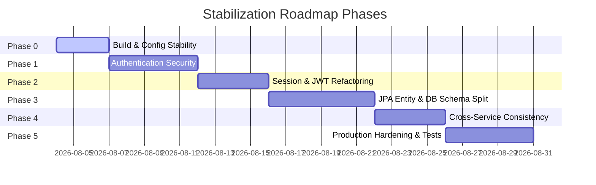

# AI Laboratory — Backend Stabilization Roadmap & Task Sheet

**Target Audience:** Incoming Backend Developer / Security Engineer  
**Context:** This document serves as a technical checklist and guide to resolve the architectural and security issues identified during the backend audit of the Authentication and User Services.

---

## Technical Tasks Summary



---

## Phase 0: Build & Configuration Stability
**Objective:** Align Java compile versions, ensure wrapper availability, and remove hardcoded secrets.

### Task 0.1: Add Maven Wrapper
*   **Goal:** Enable builds without requiring a pre-installed Maven binary on development machines.
*   **Action Items:**
    1. Run `mvn wrapper:wrapper` or copy the standard `.mvn` directory, `mvnw`, and `mvnw.cmd` scripts from a clean Maven template into the `Backend/` directory.
    2. Commit the wrapper to source control.
*   **Verification:** Confirm compilation works by running `./mvnw clean compile` from the `Backend` root folder.

### Task 0.2: Resolve JDK Version Discrepancies
*   **Goal:** Match the system compile environment with target properties.
*   **Action Items:**
    1. Either update properties in `pom.xml` to build on Java 17:
       ```xml
       <properties>
           <java.version>17</java.version>
       </properties>
       ```
    2. Or ensure that developers and CI/CD pipelines configure their default environment to JDK 21.

### Task 0.3: Secure Local Configuration Files
*   **Goal:** Prevent developers from accidentally committing real database passwords or JWT secrets.
*   **Action Items:**
    1. Remove default values for `spring.datasource.password` and `app.security.jwt-secret` in `application-local.properties`.
    2. Document in the `README.md` that developers must create a local environment file or set system variables before running.

---

## Phase 1: Authentication Security & Boundary Cleanup
**Objective:** Relocate password operations, protect login routes, and implement password update flows.

### Task 1.1: Relocate Password Hashing
*   **Goal:** Restrict raw credentials to the Authentication Service package.
*   **Action Items:**
    1. Remove `PasswordEncoder` injection from `UserAccountServiceImpl`.
    2. Update `AuthServiceImpl.register` to encrypt raw password strings *before* calling the User Service save methods:
       ```java
       // Inside AuthServiceImpl
       String encodedPassword = passwordEncoder.encode(request.password());
       User user = users.register(request.username(), request.email(), encodedPassword);
       ```
    3. Update `User` constructor to accept a pre-hashed password.
*   **Affected Files:** `UserAccountServiceImpl.java`, `AuthServiceImpl.java`, `User.java`, `UserDataSeeder.java`.

### Task 1.2: Implement Login Rate Limiting & Account Lockout
*   **Goal:** Prevent credential stuffing and brute-force guessing.
*   **Action Items:**
    1. Add columns to `users` table: `failed_login_attempts (INT)`, `locked_until (TIMESTAMPTZ)`.
    2. In `AuthServiceImpl.login`, check if the account is currently locked before processing credentials.
    3. Increment `failed_login_attempts` on authentication failures, locking the account for 15 minutes after 5 consecutive failures. Reset attempts to 0 on success.
*   **Affected Files:** `User.java`, `AuthServiceImpl.java`, SQL migrations.

### Task 1.3: Add Password Update and Reset Capabilities
*   **Goal:** Provide secure, self-service mechanisms for password changes.
*   **Action Items:**
    1. Create endpoint `PUT /api/v1/auth/change-password` requiring current password confirmation.
    2. Create endpoints `/api/v1/auth/forgot-password` (sends link/token) and `/api/v1/auth/reset-password` (accepts token and new password).
    3. Ensure password updates increment the database column `token_version` to force active access token updates.

---

## Phase 2: Session & JWT Refactoring
**Objective:** Fix multi-device session logout bugs and remove blocking database lookups from API endpoints.

### Task 2.1: Fix the Global Logout Bug
*   **Goal:** Prevent logging out of one device from terminating other sessions.
*   **Action Items:**
    1. In `AuthServiceImpl.logout`, remove the call to `users.invalidateSessions(userId)` (which increments `token_version`).
    2. Instead, simply mark the specific row in the `refresh_tokens` table as revoked (`revoked_at = CURRENT_TIMESTAMP`).
    3. Create a separate endpoint `POST /api/v1/auth/logout-all` that explicitly increments `token_version` if a user wants to invalidate all active access tokens.
*   **Affected Files:** `AuthServiceImpl.java`, `AuthController.java`.

### Task 2.2: Remove Database Lookups in JwtAuthenticationFilter
*   **Goal:** Optimize authorization filters for stateless tokens.
*   **Action Items:**
    1. In `JwtAuthenticationFilter`, extract the role and token version claims directly from the JWT.
    2. Set the `SecurityContextHolder` using claims details directly without querying `userRepository.findById(claims.getSubject())`.
    3. If active token version checks must occur (e.g. check for user blocks), query a fast in-memory Redis cache (using the user ID as a key) rather than making a synchronous PostgreSQL call.
*   **Affected Files:** `JwtAuthenticationFilter.java`.

### Task 2.3: Fix JWT Base64 Decrypt Logic
*   **Goal:** Correctly decode base64 keys.
*   **Action Items:**
    1. Update `JwtService` constructor to decode base64 property configuration strings correctly:
       ```java
       this.key = Keys.hmacShaKeyFor(Decoders.BASE64.decode(secret));
       ```

---

## Phase 3: JPA Entity & Database Schema Split
**Objective:** Separate Authentication credentials from User profiles.

### Task 3.1: Create Database Migration
*   **Goal:** Physically isolate profile fields from credential tables.
*   **Action Items:**
    1. Write a Flyway migration file `V4__split_user_profile.sql`.
    2. Create a new `user_profiles` table:
       ```sql
       CREATE TABLE user_profiles (
           user_id VARCHAR(64) PRIMARY KEY REFERENCES users(id) ON DELETE CASCADE,
           avatar_url VARCHAR(500),
           level INT NOT NULL DEFAULT 1,
           xp BIGINT NOT NULL DEFAULT 0,
           language VARCHAR(10) NOT NULL DEFAULT 'en',
           theme VARCHAR(20) NOT NULL DEFAULT 'light',
           application_settings JSONB NOT NULL DEFAULT '{}'::jsonb,
           statistics JSONB NOT NULL DEFAULT '{}'::jsonb,
           achievements JSONB NOT NULL DEFAULT '[]'::jsonb,
           updated_at TIMESTAMPTZ NOT NULL
       );
       ```
    3. Move existing profile data from `users` to `user_profiles`. Remove profile columns from the `users` table.

### Task 3.2: Refactor JPA Entities
*   **Goal:** Split the shared `User` class into package-specific entities.
*   **Action Items:**
    1. Define `UserCredentials` entity in `com.ailab.auth.domain` mapping only to `users` (id, email, username, password_hash, role, token_version).
    2. Define `UserProfile` entity in `com.ailab.user.domain` mapping only to `user_profiles`.
    3. Ensure that repositories only query their respective package entities.

### Task 3.3: Introduce Optimistic Locking
*   **Goal:** Prevent concurrent modification conflicts on profiles.
*   **Action Items:**
    1. Add a `@Version` field to both entities:
       ```java
       @Version
       private Integer version;
       ```
    2. Map version columns (`version INT NOT NULL DEFAULT 0`) in the DB migrations.

---

## Phase 4: Cross-Service Consistency & Integrations
**Objective:** Enable soft-deletes and prepare architecture for future services.

### Task 4.1: Convert Hard Deletes to Soft Deletes
*   **Goal:** Retain user ID references for other services (such as laboratory runs) while disabling access.
*   **Action Items:**
    1. Add `deleted_at (TIMESTAMPTZ)` to `users` table.
    2. Update deletion endpoints to populate this field and invalidate all active tokens.
    3. Update the login filter and details queries to ignore accounts where `deleted_at` is not null.

### Task 4.2: Implement Message Broker (Outbox Pattern)
*   **Goal:** Enable eventual consistency for future microservices.
*   **Action Items:**
    1. Add Spring AMQP (RabbitMQ) dependencies.
    2. When a profile is created, updated, or deleted, publish an event (e.g., `user.profile.deleted`) to a RabbitMQ exchange to notify other listening services.

---

## Phase 5: Production Hardening & Testing
**Objective:** Implement file uploads and write integration tests.

### Task 5.1: Replace Avatar URL String with MinIO File Storage
*   **Goal:** Securely upload and store user avatars.
*   **Action Items:**
    1. Set up a MinIO client configuration.
    2. Replace the String input endpoint with a multipart file upload endpoint:
       ```java
       @PostMapping(value = "/avatar", consumes = MediaType.MULTIPART_FORM_DATA_VALUE)
       public SuccessResponse uploadAvatar(@RequestParam("file") MultipartFile file)
       ```
    3. Validate image sizes (max 5MB) and content types (PNG/JPEG) using a magic number file signature checker.

### Task 5.2: Implement WebMvcTest Slice Tests
*   **Goal:** Verify controller routing, authorization filters, and DTO validation.
*   **Action Items:**
    1. Write tests using `@WebMvcTest(AuthController.class)` and `@WebMvcTest(UserController.class)`.
    2. Perform mock calls using `MockMvc` and verify validation failures (e.g., invalid emails return HTTP 400 with expected error DTO schemas).

### Task 5.3: Implement Database & Testcontainers Integration Tests
*   **Goal:** Verify migrations and actual repository queries under a PostgreSQL environment.
*   **Action Items:**
    1. Write test base configuration running a Docker-based PostgreSQL container using `org.testcontainers:postgresql`.
    2. Ensure that test runs execute migrations cleanly and execute transactional database modifications.
